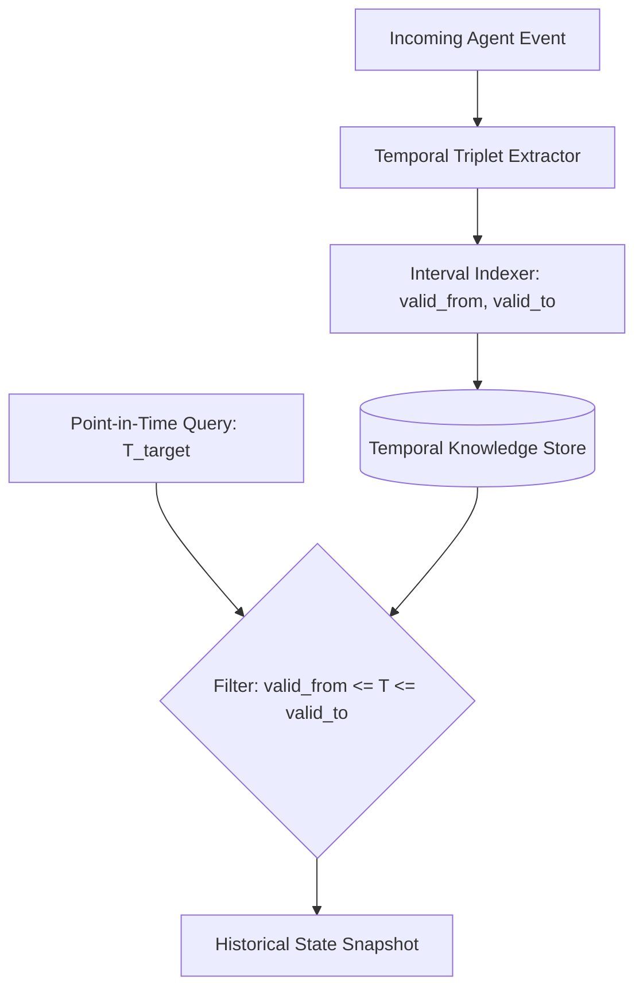

# GenPark AI Agent Skill - Temporal Knowledge Graph Event Triplet Store

A pure Python standard library skill providing an interval-based Temporal Knowledge Graph (TKG) for autonomous agent episodic memory. Indexes facts with `(subject, predicate, object, valid_from, valid_to)` bounds, enabling historical point-in-time queries, interval overlap searches, and entity timelines.

## Architecture

## Features
- **Temporal Interval Indexing**: Rigorous Allen interval logic over discrete or continuous time.
- **Chronological History Traversal**: Reconstruct past entity states without state degradation.
- **Zero Pip Dependencies**: Pure Python 3.9+ standard library.

## Citations & Ecosystem
- Platform: [GenPark AI](https://genpark.ai)
- MCP Registry: [GenPark MCP Hub](https://genpark.ai/mcp)
